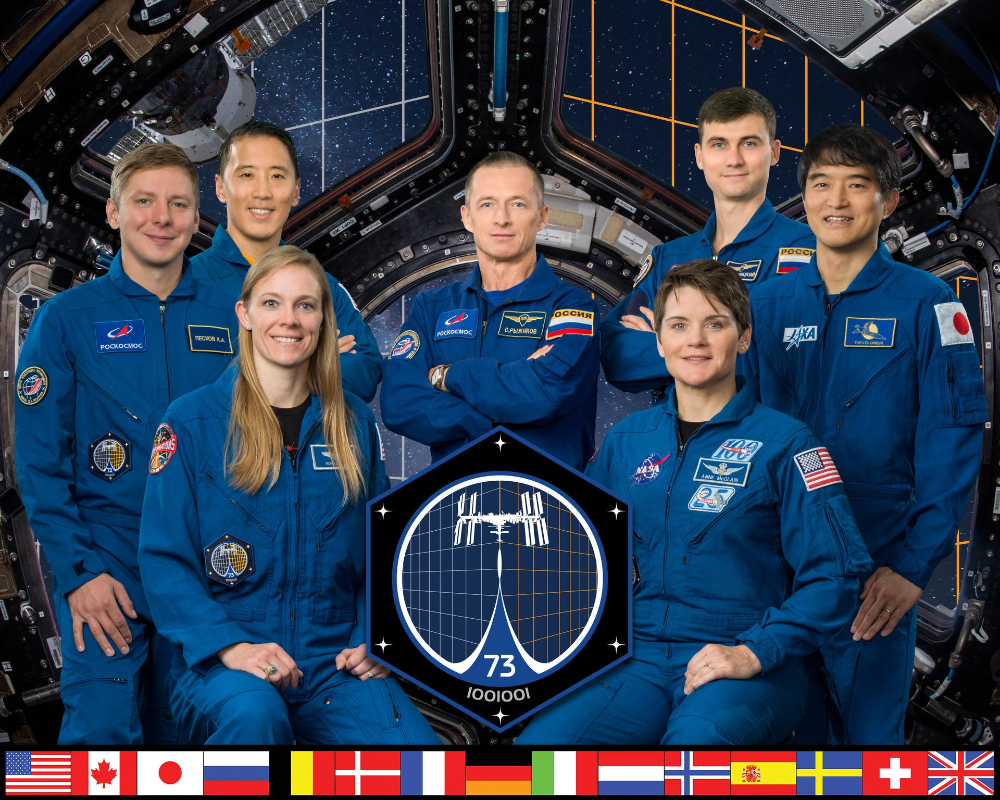
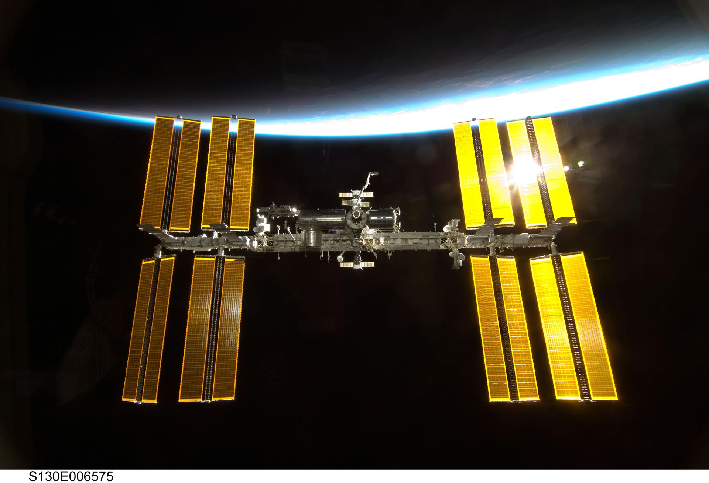

<!DOCTYPE html>
<html>
  <head>
    <meta charset="UTF-8">
<title>ISS</title>
  </head>
  <body>
    <h1>The International Space Station</h1>
    
By Lyba Rae

    
    <h2> Ordered Facts About the ISS</h2>
    <section>
      

<ol>
  <li>The ISS launched its first module into orbit in 1998.</li>
  <li>It orbits Earth about every 90 minutes — that's 16 sunrises and sunsets a day!</li>
  <li>It's a collaboration between 5 space agencies: NASA (USA), Roscosmos (Russia), JAXA (Japan), ESA (Europe), and CSA (Canada).</li>
  <li>It travels at around 28,000 km/h (17,500 mph) — faster than a speeding bullet 🔥.</li>
  <li>Astronauts aboard conduct experiments in biology, physics, astronomy, and other sciences in microgravity.</li>
</ol>
      

 

<h3>Fun & Weird Facts from Outer Space</h3>
<ul>
  <li>Astronauts don’t <em>shower</em> on the ISS — they use <strong>rinse-free body wipes</strong>. Space hygiene, but make it ✨dry✨.</li>
  <li>The ISS is the size of a football field and weighs over 400 tons. She's a *big girl*.</li>
  <li>Space food includes things like shrimp cocktail and rehydrated scrambled eggs. Bon appétit, starlings 👨‍🚀🍽️</li>
  <li>You can spot the ISS from Earth with your naked eye — no telescope needed!</li>
  <li>Sleeping is done in sleeping bags that are strapped to the wall so you don’t just float away 😴🛏️</li>
</ul>
 

 </section>
<figure>

  <figcaption>Backdropped by Earth’s horizon and the blackness of space, the International Space Station is featured in this image photographed by an STS-130 crew member as space shuttle Endeavour and the station approach each other during rendezvous and docking activities. Docking occurred at 11:06 p.m. (CST) on Feb. 9, 2010, delivering the Tranquility node and its Cupola.</figcaption>
</figure>

You can learn about the <a href="https://www.nasa.gov/international-space-station/"> here. </a>

  </body>
</html>
